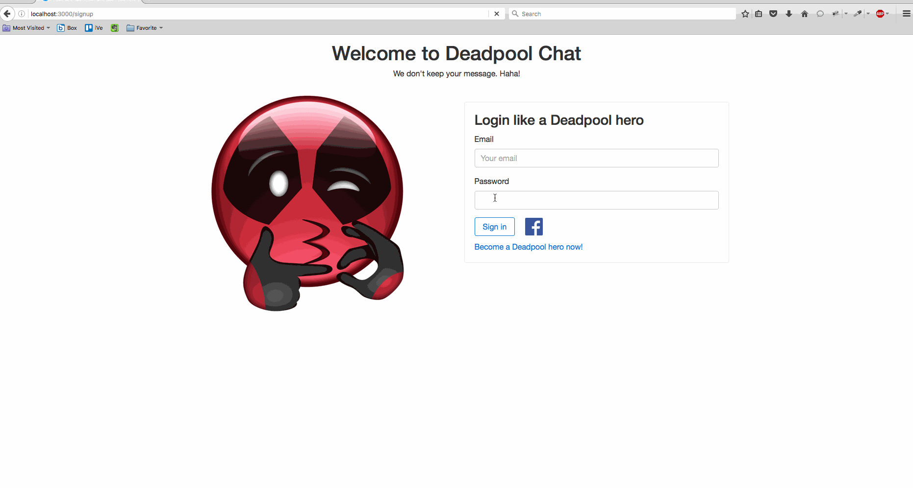

# Homework 2 - *Deadpool chat*

**Deadpool chat** is a Ruby on Rails blog application that allows users to send messages to each other that can only be read once.

Submitted by: **Leo Le**

Time spent: **15** hours

URL: **https://calm-tundra-22594.herokuapp.com/**

## User Stories

The following **required** functionality is complete:

* [x] User can sign up by providing their email, password, and name.
* [x] User can login using an email and password.
* [x] After logging in, the user is taken to a page that has a list of incoming messages, sorted in descending chronological order (newest messages at top), a "new message" link, an "add friends" link, and a "sent messages" link.
* [x] Unread messages should be **bold** or something similar in the list of messages.
* [x] Clicking the "add friends" link takes the user to a page with all users listed, with a link to "add user to friends list".
* [x] Clicking on "new message" takes the user to a page where they can write a new mesasge. The recipient field should be a dropdown, where the options are names from the user's friends.
* [x] Clicking on "sent messages" takes the user to a page listing messages they have sent. Each message should display at what time it was read by the recipient, or "unread". The user cannot read the contents of the messages.
* [x] User can read a message's content only once. Once the message has been read, the user will see a page indicating the message has already been read.
* [x] User can only read messages where they are the recipient.

The following **optional** functionality is complete:

* [ ] User can attach an image.
* [ ] User can have multiple recipients on one message.
* [ ] User can log in with Facebook.
* [ ] User A can "block" User B. If User A blocks User B, they will not see messages from User B. User B will not know they have been blocked.
* [x] User can remove friends from their friends list.
* [ ] User can unblock friends from their block list.
* [ ] Implement Infinite Scroll. Hint: you can use the [kaminari gem](https://github.com/amatsuda/kaminari) and [jquery-infinite-pages gem](https://github.com/magoosh/jquery-infinite-pages).
* [ ] User gets an email when they receive a message, with a link to view the message.
* [ ] User gets an email when a message they have sent is read with the time at which the message was read.
* [ ] User can send a message to the email address of a non-registered user. The recipient will receive an email with a link to sign up for the service, and after creating an account, will be able to view the sent message.

The following **additional** features are implemented:

* [x] I use ActionCable to create a unique channel for 2 users for chatting. This feature requires redis installation. However, I can't verify my credit account on heroku so I can't install **redistogo** addon. In the end of the day, it only works on my local machine :)
* [x] I think it becomes a chat app better when I merge the incoming and sent messages in to one page

## Video Walkthrough

Here's a walkthrough of implemented user stories:

GIF created with [LiceCap](http://www.cockos.com/licecap/).

## Notes

* I met the problem with ActionCable when it can't access the session to get the current_user. It leads to the consequence that I can't detect when a user come or out the connection of the reservation channel.

## License

    Copyright [2016] [Leo Le]

    Licensed under the Apache License, Version 2.0 (the "License");
    you may not use this file except in compliance with the License.
    You may obtain a copy of the License at

        http://www.apache.org/licenses/LICENSE-2.0

    Unless required by applicable law or agreed to in writing, software
    distributed under the License is distributed on an "AS IS" BASIS,
    WITHOUT WARRANTIES OR CONDITIONS OF ANY KIND, either express or implied.
    See the License for the specific language governing permissions and
    limitations under the License.
